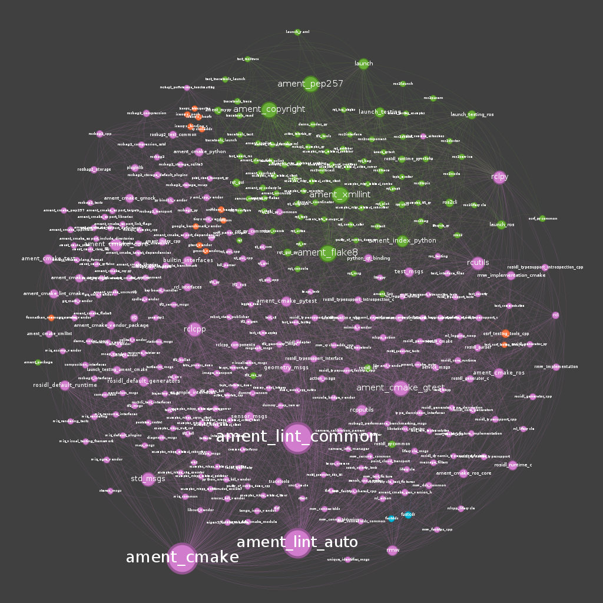
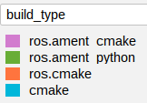

# colcon_gephi

Colcon plugin to generate a rich dependency graph for packages in a ROS 2 workspace. Resulting graph is intended for 
viewing in [Gephi](https://gephi.org/), but should be usable in other graph viewing tools like [GraphViz](https://graphviz.org/)
or [Graphia](https://graphia.app/), although these have not been verified.

Below is an example graph of the [workspace for the ros2 rolling repos](https://docs.ros.org/en/rolling/Installation/Alternatives/Ubuntu-Development-Setup.html#get-ros-2-code).
For details on what the graph actually is showing, see [Example Graph](#example-graph).


## Features

Currently supports exporting in:
- **DOT** (default, for Graphviz and other generic graph tools)
- **GML** (human-readable text format, supported by many graph libraries)
- **GEXF** (ideal for Gephi, preserves complex attributes)

Unlike `colcon graph`, this extension preserves extra package metadata (e.g., maintainers, repository info, build type)
as node attributes. This makes it easier to analyze dependency relationships visually in Gephi.

- Generates a graph file from your ROS 2 workspace using the same package descriptors as `colcon graph`.
- Automatically includes the following as node attributes:
    - Package path
    - Build type
    - Maintainers
    - Version
    - Git repository name and remote URL (if applicable)
    - Lines of Code (LOC) stats (see [Optional Dependencies](#optional-dependencies))
- Includes edges for build, run, and test dependencies between packages in the workspace.
- Produces output ready to open in Gephi — no manual attribute editing required.

## Install from PyPI
```bash
python3 -m pip install colcon_gephi
```

## Usage

```bash
cd ros2_rolling/
colcon gephi_graph
```

The generated `.dot` file will have the name of the directory the command was run in. So in this case,
it is `ros2_rolling.dot`.

To change the file format, pass the `--format` flag.
```bash
colcon gephi_graph --format gml
```

## Optional Dependencies
This package optionally depends on [cloc](https://github.com/AlDanial/cloc/) to LOC-related node attributes. 
If `cloc` is not found on the system, a warning is printed, and the LOC-related attributes are not added.

## Gephi Tips
Gephi can be quite complex to use. It is recommended to read a [few tutorials on usage](https://gephi.org/users/).

### Node Size Based on Attribute
For whatever reason, when networkx exports a graph, the resulting (by default) `.dot` file will not respect data types.
Everything will be a string. This means that you cannot do things like change the size of nodes based on attributes like
`lines_of_code` by default. You need to make a new column, and copy the data over to this new column with the 
appropriate data type.

### Example Graph
The graph generated at the top of this README was laid out by following this [video](https://www.youtube.com/watch?v=eI2YSIJxPLw). 
Larger nodes are nodes with more "in-degree" edges (i.e. edges pointing into them), which gives a visual representation of how many packages depend on them.
Finally, the colors are based on the package build_type (i.e. ros.ament_cmake, ros.ament_python, etc).


